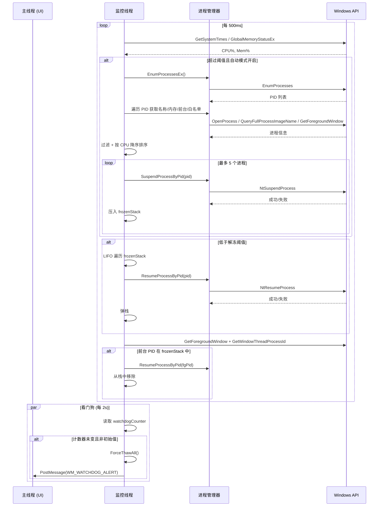
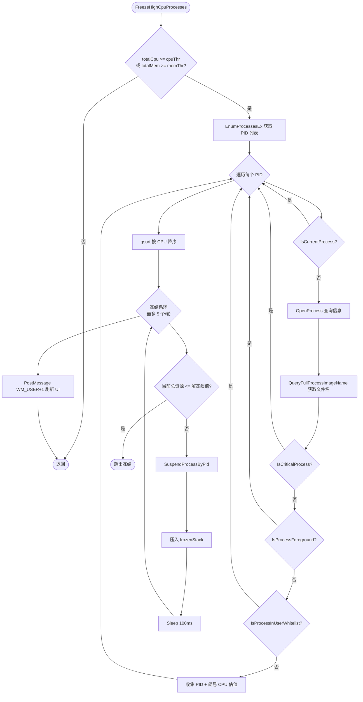

# Stasis 系统架构文档

## 概述

**Stasis** 是一个 Windows 平台的**进程管理器**，用于监控系统 CPU/内存占用，在资源紧张时自动**冻结（挂起）高占用进程**，并在资源释放或用户交互时自动**解冻（恢复）**。它使前台应用在高负载环境下保持响应，防止系统卡顿。

**核心能力**：
- 实时监控全系统 CPU/内存使用率（500ms 间隔）
- 基于阈值的智能冻结/解冻调度（CPU ≥ 85%、内存 ≥ 90% 触发冻结；≤ 60% 触发解冻）
- 进程白名单机制（系统关键进程 + 用户自定义）保护关键服务不被误伤
- 前台进程自动唤醒：用户切换到已冻结窗口时立即解冻
- 看门狗机制：UI 线程卡死 2 秒以上时强制解冻所有进程
- 系统托盘驻留，关闭窗口即最小化到托盘后台运行

**目标用户**：Windows 开发者、重度多任务用户、资源受限设备（如 8GB 内存笔记本）用户

## 技术栈

| 分类 | 技术/工具 | 版本/说明 |
|------|----------|-----------|
| **语言** | C (C99) | 纯 Win32 API，无运行时依赖 |
| **编译器** | MSVC (Visual Studio 2022) | `/MT /O2 /GL /W4 /utf-8` |
| **构建** | build.bat + GitHub Actions | 单文件脚本，支持版本号参数 |
| **UI 框架** | 原生 Win32 + Common Controls 6.0 | 自绘圆角按钮、渐变进度条、开关、滑块 |
| **进程控制** | NtSuspendProcess / NtResumeProcess (ntdll.dll) | 动态加载，需 SeDebugPrivilege |
| **配置存储** | INI 文件 (Stasis.ini) + 注册表 (自启动) | GetPrivateProfileString/WritePrivateProfileString |
| **日志** | 自实现循环日志 (Stasis.log) | 临界区同步，超 50KB 自动截断保留 500 行 |
| **CI/CD** | GitHub Actions (windows-latest) | vswhere 动态定位 MSVC，上传 Artifact/Release |

## 项目结构

```
Stasis/
├── .github/workflows/build.yml   # CI/CD 工作流
├── .gitignore
├── build.bat                     # 编译脚本（支持版本号参数）
├── manifest.xml                  # 管理员清单 + DPI 感知
├── resource.rc                   # 资源文件（图标、版本信息、清单）
├── stasis.ico                    # 应用图标
├── Stasis.h                      # 统一头文件（类型、宏、外部声明）
├── main.c                        # 入口：DPI感知、单实例、消息循环、监控线程启动
├── app_window.c                  # 主窗口：自绘标题栏、ListView、自绘控件、托盘交互
├── process_manager.c             # 进程核心：挂起/恢复、枚举、白名单、前台检测
├── monitor_engine.c              # 监控引擎：CPU/内存采样、冻结/解冻调度、看门狗
├── ui_controls.c                 # 自绘控件：圆角按钮、渐变进度条、开关、滑块
├── tray_icon.c                   # 系统托盘：图标、右键菜单、显示/暂停/退出
├── settings_store.c              # 配置持久化：INI 读写、白名单、开机自启
├── log.c                         # 日志系统：带时间戳、线程安全、自动轮转
└── Stasis.log                    # 运行日志（运行时生成）
```

## 入口点

| 入口 | 文件 | 说明 |
|------|------|------|
| `wWinMain` | `main.c:6` | 程序入口，初始化全局状态、创建窗口、启动监控线程、消息循环 |
| `CreateMainWindow` | `app_window.c:67` | 注册窗口类、创建无边框窗口、启用亚克力模糊、初始化字体 |
| `MainWndProc` | `app_window.c:128` | 窗口过程：WM_CREATE/WM_PAINT/WM_COMMAND/WM_DRAWITEM/WM_TRAYICON/WM_CLOSE 等 |
| `MonitorThread` | `monitor_engine.c:136` | 后台监控线程：定时采样、冻结/解冻调度、看门狗、前台唤醒 |

## 子系统

### 1. 进程管理子系统 (`process_manager.c`)

**目的**：提供进程挂起/恢复、枚举、内存查询、白名单判断、前台检测等核心能力

**位置**: `process_manager.c`

**关键文件**: `process_manager.c`, `Stasis.h` (声明)

**依赖**: `ntdll.dll` (NtSuspendProcess/NtResumeProcess), `psapi.dll`, `kernel32.dll`

**被依赖**: `monitor_engine.c` (冻结/解冻), `app_window.c` (刷新列表)

| 函数 | 用途 |
|------|------|
| `InitProcessAPI()` | 加载 ntdll.dll 并获取 NtSuspendProcess/NtResumeProcess 函数指针 |
| `EnableDebugPrivilege()` | 开启 SeDebugPrivilege，允许操作系统进程 |
| `SuspendProcessByPid(pid)` | 挂起指定 PID 进程 |
| `ResumeProcessByPid(pid)` | 恢复指定 PID 进程 |
| `EnumProcessesEx()` | 枚举所有进程 PID |
| `GetProcessMemoryKB(pid, &mem)` | 获取进程工作集内存 (KB) |
| `IsCriticalProcess(name)` | 检查是否为系统关键进程 (System、csrss、winlogon、services、lsass、svchost、explorer、dwm、taskmgr) |
| `IsProcessInUserWhitelist(name)` | 检查用户自定义白名单 (线程安全) |
| `IsProcessForeground(pid)` | 判断进程是否拥有前台窗口 |
| `IsCurrentProcess(pid)` | 自我保护：防止冻结自身导致死锁 |

### 2. 监控调度子系统 (`monitor_engine.c`)

**目的**：后台线程周期性采样系统资源，按阈值决策冻结/解冻，实现看门狗与前台唤醒

**位置**: `monitor_engine.c`

**关键文件**: `monitor_engine.c`, `Stasis.h`

**依赖**: `process_manager.c`, `kernel32.dll` (GetSystemTimes, GlobalMemoryStatusEx)

**被依赖**: `main.c` (启动线程), `app_window.c` (WM_WATCHDOG_ALERT)

| 函数/结构 | 用途 |
|-----------|------|
| `GetTotalCpuUsage()` | 采样系统空闲/内核/用户时间，计算总 CPU 占用率 |
| `GetTotalMemUsage()` | 调用 GlobalMemoryStatusEx 获取内存负载百分比 |
| `ProcCpu` 结构体 | 临时存储 PID 与 CPU 占用，用于排序 |
| `FreezeHighCpuProcesses()` | 核心冻结逻辑：枚举进程 → 过滤白名单/前台/关键/自身 → 按 CPU 降序 → 每轮最多冻结 5 个 → 记录栈 |
| `ThawProcessesIfNeeded()` | 解冻逻辑：总 CPU/内存均 ≤ 解冻阈值时，LIFO 顺序恢复，中途阈值超标即停止 |
| `ForceThawAll()` | 强制解冻所有 (看门狗触发、退出时) |
| `MonitorThread()` | 主循环：2s 看门狗检测 → 自动模式下调用冻结/解冻 → 前台唤醒检测 → Sleep(500ms) |

**调度策略**：
- **触发条件**：`totalCpu >= cpuThreshold (默认85%)` **或** `totalMem >= memThreshold (默认90%)`
- **选择目标**：按单进程 CPU 占用降序，跳过白名单/前台/关键/自身
- **限速**：单轮最多冻结 5 个进程，冻结间隔 100ms
- **解冻条件**：`totalCpu <= thawThreshold (默认60%)` **且** `totalMem <= thawThreshold`
- **解冻顺序**：后进先出 (LIFO)，最近冻结的最先解冻
- **前台唤醒**：检测前台窗口 PID 在冻结栈中 → 立即解冻并移除

### 3. UI 交互子系统 (`app_window.c` + `ui_controls.c`)

**目的**：现代化无边框窗口，自绘标题栏、状态栏、ListView、自定义控件

**位置**: `app_window.c`, `ui_controls.c`

**关键文件**: `app_window.c`, `ui_controls.c`, `Stasis.h`

**依赖**: `comctl32.dll` (ListView), `msimg32.dll` (GradientFill), `user32.dll` (窗口子类化)

| 组件 | 实现 |
|------|------|
| **窗口** | `WS_POPUP | WS_THICKFRAME` 无标题栏，左键拖拽移动，WM_NCHITTEST 模拟 |
| **标题栏** | `DrawTitleBar()` 绘制背景、图标、文字、最小化/关闭按钮 (自绘圆角) |
| **状态栏** | CPU/内存渐变进度条 + 冻结计数，WM_TIMER 1s 刷新 |
| **进程列表** | ListView (Report 模式)，列：状态图标/进程名/PID/CPU%/内存(KB) |
| **自绘按钮** | `BS_OWNERDRAW` + `WM_DRAWITEM` → `DrawRoundedButton()` |
| **开关** | `WM_DRAWITEM` → `DrawToggleSwitch()` 圆形滑块动画 |
| **滑块** | 子类化 `SliderSubclassProc`，鼠标拖动更新阈值 (5% 步进) |
| **渐变进度条** | `msimg32.dll!GradientFill` 双色渐变，边框矩形 |
| **亚克力模糊** | `SetWindowCompositionAttribute` + `ACCENT_ENABLE_BLURBEHIND` (Win10 1809+) |
| **DPI 感知** | `SetProcessDpiAwarenessContext(DPI_AWARENESS_CONTEXT_PER_MONITOR_AWARE_V2)` + `WM_DPICHANGED` 重建字体 |

### 4. 托盘交互子系统 (`tray_icon.c`)

**目的**：窗口隐藏时驻留系统托盘，提供右键菜单控制

**位置**: `tray_icon.c`

**关键文件**: `tray_icon.c`, `Stasis.h`

| 功能 | 实现 |
|------|------|
| `CreateTrayIcon(hwnd)` | `Shell_NotifyIconW(NIM_ADD)` 注册图标、提示、回调消息 `WM_TRAYICON` |
| `ShowTrayMenu(hwnd)` | `CreatePopupMenu` + `TrackPopupMenu`：显示/暂停自动/全部解冻并退出 |
| `UpdateTrayIcon(count)` | 修改提示文本显示冻结数 (当前仅 `NIM_MODIFY`) |
| 双击托盘 | `WM_LBUTTONDBLCLK` → 显示窗口、恢复正常优先级 |
| 右键菜单 | "显示主界面" / "暂停自动模式✓" / "全部解冻并退出" |

### 5. 配置持久化子系统 (`settings_store.c`)

**目的**：INI 文件存储阈值、自动模式、用户白名单；注册表管理开机自启

**位置**: `settings_store.c`

**关键文件**: `settings_store.c`, `Stasis.h`

| 配置项 | 存储位置 | 读写 API |
|--------|----------|----------|
| CpuThreshold/MemThreshold/ThawThreshold | `Stasis.ini` [Settings] | `GetPrivateProfileIntW` / `WritePrivateProfileStringW` |
| AutoMode | 同上 | 同上 |
| Whitelist (分号分隔) | 同上 | 同上 (读时 `wcstok_s` 分割，写时拼接) |
| 开机自启 | `HKCU\Software\Microsoft\Windows\CurrentVersion\Run` | `RegSetValueExW` / `RegDeleteValueW` |

### 6. 日志子系统 (`log.c`)

**目的**：线程安全的带时间戳日志，支持调试模式，文件过大自动轮转

**位置**: `log.c`

**关键文件**: `log.c`, `Stasis.h`

| 特性 | 实现 |
|------|------|
| 线程安全 | `CRITICAL_SECTION g_LogCs` 保护所有写操作 |
| 时间戳 | `GetLocalTime` 精确到毫秒：`[YYYY-MM-DD HH:MM:SS.mmm]` |
| 调试日志 | `DebugLog()` 仅 `g_DebugMode=TRUE` 时写入 |
| 自动轮转 | 文件 > 50KB 时读取所有行，保留最后 500 行重写 |
| 全局句柄 | `g_State.logFile` 供外部访问 |

## 数据流与核心结构

### 全局状态 `AppState` (定义于 `Stasis.h:58`)

```c
typedef struct {
    // 监控配置
    BOOL autoMode;              // 自动模式开关
    int cpuThreshold;           // CPU 冻结阈值 (默认 85)
    int memThreshold;           // 内存冻结阈值 (默认 90)
    int thawThreshold;          // 解冻阈值 (默认 60)

    // 白名单
    WCHAR** userWhitelist;      // 动态数组
    int whitelistCount;

    // 冻结栈 (LIFO)
    DWORD frozenStack[1024];    // 存储 PID
    int frozenCount;

    // 同步
    CRITICAL_SECTION cs;        // 保护以上共享字段

    // 监控线程
    HANDLE hMonitorThread;
    volatile BOOL monitorRunning;

    // UI 句柄
    HWND hMainWnd;
    HWND hListView;

    // 托盘
    BOOL trayVisible;
    BOOL pauseAuto;             // 托盘菜单"暂停自动模式"

    // 看门狗
    volatile LONG watchdogCounter; // UI 线程每秒递增

    // 日志
    FILE* logFile;

    // 亚克力
    BOOL acrylicEnabled;
} AppState;
```

### 关键数据流

```mermaid
flowchart LR
    subgraph UI[UI 线程 (主线程)]
        A[wWinMain] --> B[CreateMainWindow]
        B --> C[MainWndProc 消息循环]
        C --> D[WM_TIMER 1s 刷新]
        C --> E[WM_COMMAND 用户操作]
        C --> F[WM_DRAWITEM 自绘控件]
        C --> G[WM_WATCHDOG_ALERT 强制解冻提示]
    end

    subgraph Monitor[监控线程 (MonitorThread)]
        H[Sleep 500ms] --> I{自动模式且未暂停?}
        I -->|是| J[FreezeHighCpuProcesses]
        J --> K[ThawProcessesIfNeeded]
        I -->|否| H
        K --> L[看门狗 2s 检查]
        L --> M{UI 计数器未变?}
        M -->|是| N[ForceThawAll + PostMessage WM_WATCHDOG_ALERT]
        M -->|否| H
        K --> O[前台唤醒检测]
        O --> H
    end

    subgraph Shared[共享状态 (临界区保护)]
        P[g_State.frozenStack]
        Q[g_State.frozenCount]
        R[g_State.autoMode/阈值]
        S[g_State.userWhitelist]
    end

    C -.->|读/写| Shared
    Monitor -.->|读/写| Shared
    E -.->|SaveSettings| T[(Stasis.ini)]
    Monitor -.->|LogEvent| U[(Stasis.log)]
```

## 图表

### 系统架构图

```mermaid
flowchart TB
    subgraph User[用户交互]
        UI[主窗口\napp_window.c]
        Tray[系统托盘\ntray_icon.c]
        Settings[设置对话框\n(待实现)]
    end

    subgraph Core[核心逻辑]
        Monitor[监控线程\nmonitor_engine.c]
        ProcessMgr[进程管理\nprocess_manager.c]
        Config[配置存储\nsettings_store.c]
        LogSys[日志系统\nlog.c]
    end

    subgraph OS[Windows OS API]
        NTDLL[ntdll.dll\nNtSuspend/ResumeProcess]
        PSAPI[psapi.dll\nEnumProcesses/GetProcessMemoryInfo]
        Kernel32[kernel32.dll\nGetSystemTimes/GlobalMemoryStatusEx]
        User32[user32.dll\n窗口/消息/前台窗口]
        Comctl32[comctl32.dll\nListView]
        Shell32[shell32.dll\nShell_NotifyIcon]
        Msimg32[msimg32.dll\nGradientFill]
    end

    UI -->|WM_COMMAND/WM_DRAWITEM| Monitor
    UI -->|读配置/写配置| Config
    Tray -->|菜单命令| UI
    Monitor -->|冻结/解冻/枚举| ProcessMgr
    Monitor -->|看门狗/前台唤醒| User32
    ProcessMgr -->|挂起/恢复进程| NTDLL
    ProcessMgr -->|枚举/内存/名称| PSAPI
    Monitor -->|CPU/内存采样| Kernel32
    Config -->|INI 读写| Kernel32
    Config -->|注册表自启| User32
    LogSys -->|文件写入| Kernel32
    UI -->|自绘/渐变| Msimg32
    UI -->|ListView| Comctl32
    UI -->|托盘图标| Shell32
```

### 监控线程时序图



### 进程冻结/解冻流程图



## 核心概念

详见 [专有概念](./专有概念/) 目录：
- **冻结栈** - LIFO 结构管理被挂起进程 PID
- **阈值体系** - 冻结/解冻的双阈值滞回机制
- **白名单机制** - 系统级 + 用户级双层保护
- **看门狗** - UI 线程心跳检测与强制恢复
- **前台唤醒** - 用户交互触发的即时解冻

## 模块详情

详见 [模块](./模块/) 目录：
- [app_window 模块](./模块/app_window.md) - 主窗口与 UI 交互
- [process_manager 模块](./模块/process_manager.md) - 进程操作核心
- [monitor_engine 模块](./模块/monitor_engine.md) - 监控调度引擎
- [ui_controls 模块](./模块/ui_controls.md) - 自绘控件库
- [tray_icon 模块](./模块/tray_icon.md) - 系统托盘交互
- [settings_store 模块](./模块/settings_store.md) - 配置持久化
- [log 模块](./模块/log.md) - 日志系统