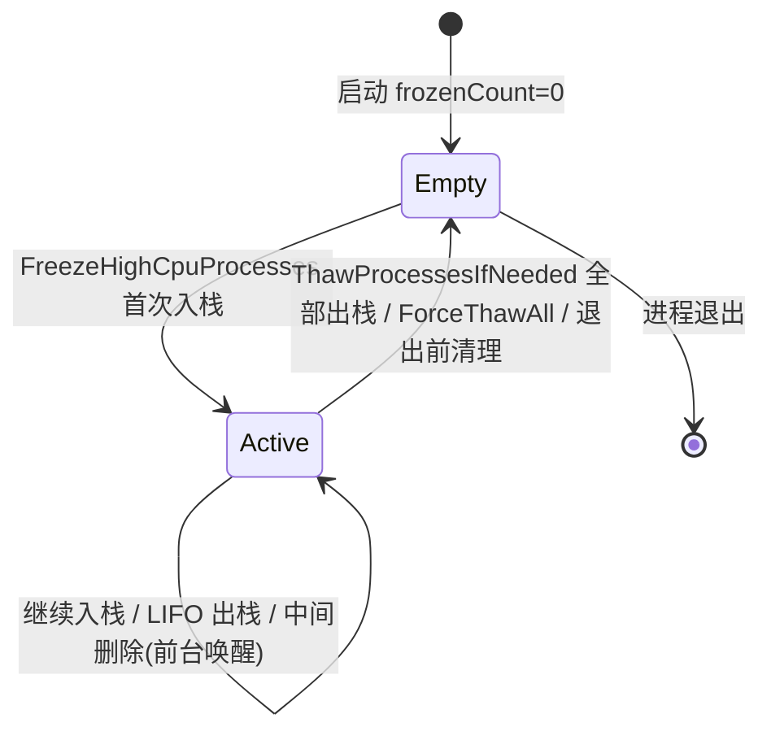

# 冻结栈

**冻结栈** 是 `AppState` 中的定长数组 (`DWORD frozenStack[1024]`)，作为 **LIFO (后进先出)** 栈管理所有被挂起进程的 PID，支撑解冻顺序、前台唤醒移除、看门狗强制全量解冻。

## 什么是冻结栈？

| 属性 | 值 |
|------|-----|
| 容量 | 1024 个 PID (足够覆盖极端高负载) |
| 结构 | 数组 + 栈顶索引 (`frozenCount`) |
| 同步 | `CRITICAL_SECTION cs` 保护所有读写 |
| 入栈时机 | `FreezeHighCpuProcesses` 成功 `SuspendProcessByPid` 后 |
| 出栈时机 | `ThawProcessesIfNeeded` 解冻 / `ForceThawAll` 强制 / 前台唤醒 / 退出清理 |

## 关键特征

| 特征 | 说明 |
|------|------|
| **LIFO 顺序** | 最近冻结的最先解冻，符合“后台任务优先恢复”直觉 |
| **线程安全** | 所有 `frozenStack` / `frozenCount` 访问均在 `Enter/LeaveCriticalSection(&g_State.cs)` 中 |
| **无重复** | 同一 PID 不会重复入栈 (冻结前已检查是否在栈中，见 `monitor_engine.c:93-96`) |
| **容量上限** | 1024，极端情况下防止溢出 (未满检查 `g_State.frozenCount < 1024`) |
| **简化实现** | 无动态分配，栈内存随 `AppState` 静态存在 |

## 代码位置

| 操作 | 文件:行 | 函数/上下文 |
|------|---------|-------------|
| 定义 | `Stasis.h:68-69` | `DWORD frozenStack[1024]; int frozenCount;` |
| 入栈 | `monitor_engine.c:93-96` | `FreezeHighCpuProcesses` 成功挂起后 `frozenStack[frozenCount++] = pid` |
| 出栈 (LIFO) | `monitor_engine.c:110-118` | `ThawProcessesIfNeeded` `while (frozenCount>0) { pid = frozenStack[--frozenCount]; ResumeProcessByPid(pid); }` |
| 强制全量出栈 | `monitor_engine.c:123-134` | `ForceThawAll` 循环 `--frozenCount` 恢复全部 |
| 前台唤醒移除 | `monitor_engine.c:174-186` | `MonitorThread` 检测前台 PID 在栈中 → `memmove` 覆盖删除 + `--frozenCount` + `ResumeProcessByPid` |
| 退出清理 | `main.c:70` | `ForceThawAll()` 确保全部恢复再退出 |

## 结构

```c
// Stasis.h 内 AppState
typedef struct {
    // ...
    CRITICAL_SECTION cs;           // 保护以下字段
    DWORD frozenStack[1024];       // PID 栈 (栈底 index=0，栈顶 index=frozenCount-1)
    int frozenCount;               // 当前栈大小 (0 = 空)
    // ...
} AppState;
```

### 栈操作伪代码

```c
// 入栈 (冻结成功后)
EnterCriticalSection(&g_State.cs);
if (g_State.frozenCount < 1024)
    g_State.frozenStack[g_State.frozenCount++] = pid;
LeaveCriticalSection(&g_State.cs);

// 出栈 (解冻)
EnterCriticalSection(&g_State.cs);
while (g_State.frozenCount > 0) {
    DWORD pid = g_State.frozenStack[--g_State.frozenCount];
    LeaveCriticalSection(&g_State.cs);
    ResumeProcessByPid(pid);  // 耗时操作在锁外
    EnterCriticalSection(&g_State.cs);
    if (资源又高了) break;   // ThawProcessesIfNeeded 中途阈值超标停止
}
LeaveCriticalSection(&g_State.cs);

// 前台唤醒移除 (中间删除)
EnterCriticalSection(&g_State.cs);
for (int i = 0; i < g_State.frozenCount; i++) {
    if (g_State.frozenStack[i] == fgPid) {
        DWORD wakePid = fgPid;
        memmove(&g_State.frozenStack[i], &g_State.frozenStack[i+1],
                (g_State.frozenCount - i - 1) * sizeof(DWORD));
        g_State.frozenCount--;
        LeaveCriticalSection(&g_State.cs);
        ResumeProcessByPid(wakePid);
        EnterCriticalSection(&g_State.cs);
        break;
    }
}
LeaveCriticalSection(&g_State.cs);
```

## 不变量

1. **索引有效**：`0 <= frozenCount <= 1024` 始终成立
2. **栈内无重复 PID**：冻结前已确认 PID 不在栈中
3. **锁保护**：任何读/写 `frozenStack`/`frozenCount` 均在 `cs` 临界区内
4. **锁外调用耗时 API**：`SuspendProcessByPid` / `ResumeProcessByPid` 在 `LeaveCriticalSection` 后调用，避免长时间持锁阻塞 UI/监控线程
5. **退出前清零**：`main.c` 退出流程调用 `ForceThawAll()` 保证 `frozenCount == 0` 再释放资源

## 生命周期



### 状态描述

| 状态 | `frozenCount` | 典型触发 |
|------|---------------|----------|
| `Empty` | 0 | 启动、资源充足全解冻、强制全解冻后、退出前 |
| `Active` | 1~1023 | 高负载持续冻结、解冻进行中、前台唤醒移除 |

## 关系

```mermaid
erDiagram
    FROZEN_STACK ||--|{ PID : contains
    MONITOR_THREAD ||--o{ FROZEN_STACK : pushes/pops (locked)
    THAW_LOGIC ||--o{ FROZEN_STACK : LIFO pops
    FORCE_THAW ||--o{ FROZEN_STACK : drains all
    FOREGROUND_WAKE ||--o{ FROZEN_STACK : removes middle
    MAIN_EXIT ||--o{ FROZEN_STACK : ForceThawAll on cleanup
```

| 关联概念 | 关系 | 描述 |
|----------|------|------|
| `MonitorThread` | 生产者/消费者 | `FreezeHighCpuProcesses` 入栈；`ThawProcessesIfNeeded`/`ForceThawAll` 出栈 |
| `ThawProcessesIfNeeded` | LIFO 消费者 | 按栈序恢复，中途阈值超标即停 |
| `ForceThawAll` | 栈清空者 | 看门狗/退出时无条件全量出栈 |
| `ForegroundWake` | 中间删除 | 前台 PID 在栈中 → `memmove` 删项 + 单独恢复 |
| `MainExit` | 清理钩子 | `ForceThawAll()` 确保无残留挂起进程 |

## 设计权衡

| 方案 | 优点 | 缺点 | 选择理由 |
|------|------|------|----------|
| **定长数组 + 栈顶索引** (当前) | 无堆分配、O(1) 入栈/出栈、缓存友好 | 容量固定 1024 | 进程数极难超 1024，简单可靠 |
| `std::vector` / 动态数组 | 无容量上限 | 需 CRT/堆、引入分配失败风险、C 语言手动管理繁琐 | 过度设计 |
| 链表 | 无容量限制、中间删除 O(1) | 指针追踪、缓存未命中、内存碎片 | 栈操作为主，中间删极少，数组更优 |

## 扩展建议

- **可观测性**：在 `Stasis.log` 记录每次 `FrozenCount` 变化 (已有 `LogEvent(L"Frozen PID %lu")` / `Resumed PID %lu`)
- **溢出保护**：当前 `if (frozenCount < 1024)` 静默丢弃，可改为 `LogEvent(L"Stack full, skip PID %lu")` 告警
- **可视化**：主窗口 ListView 已显示冻结图标 (❄️)，可增加 "冻结栈深度" 状态栏项