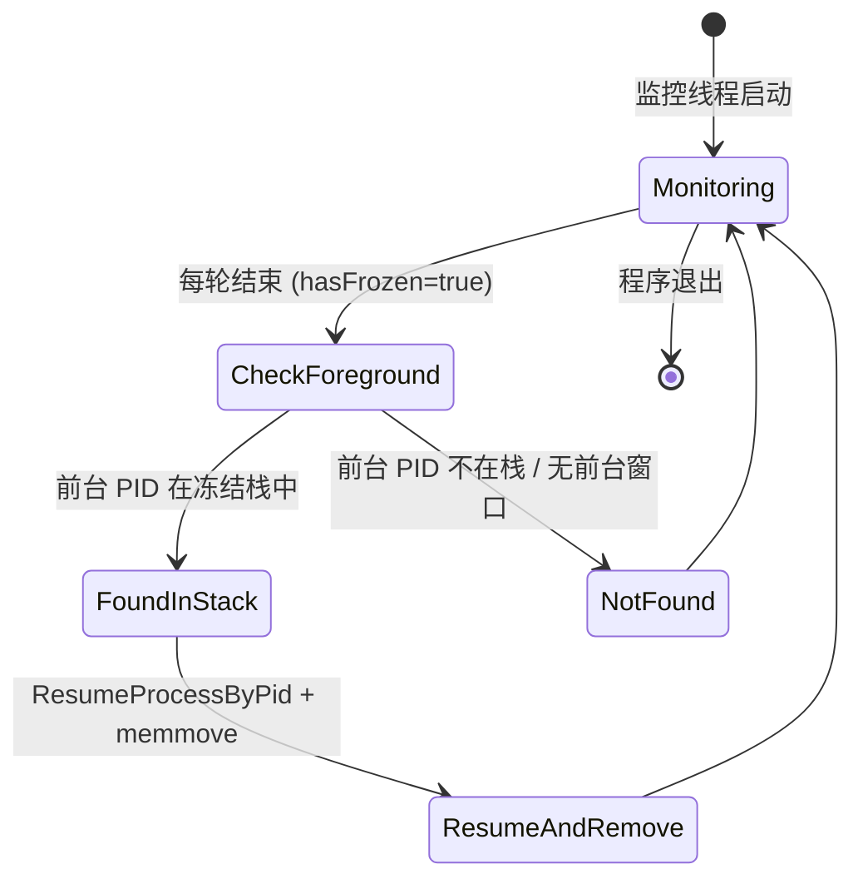

# 前台唤醒

**前台唤醒** 机制确保用户主动切换到已被冻结的进程时，该进程能**立即解冻并恢复运行**，保障交互流畅，避免"点击窗口无反应"的困惑。

## 什么是前台唤醒？

监控线程每轮 (`MONITOR_INTERVAL=500ms`) 结束前，调用 `GetForegroundWindow` + `GetWindowThreadProcessId` 获取当前前台窗口 PID，若该 PID 存在于 **冻结栈** 中 → 立即 `ResumeProcessByPid` 并从栈中移除。

## 关键特征

| 特征 | 说明 |
|------|------|
| **检测频率** | 500ms (同监控主循环 `Sleep(MONITOR_INTERVAL)`) |
| **触发条件** | 前台窗口 PID ∈ `g_State.frozenStack[0..frozenCount-1]` |
| **响应动作** | 1. `ResumeProcessByPid(fgPid)` 解冻<br>2. `memmove` 从数组中删除该 PID (保持栈连续)<br>3. `frozenCount--` |
| **优先级** | 高于阈值解冻：即使系统总 CPU/内存仍高于解冻阈值，前台唤醒也强制执行 |
| **单次仅唤醒一个** | 每轮最多处理一个前台 PID (找到即 `break`)，避免同一轮多次 `GetForegroundWindow` 竞态 |

## 代码位置

| 逻辑 | 文件:行 |
|------|---------|
| 前台检测主块 | `monitor_engine.c:161-190` (`MonitorThread` 末尾 `if (hasFrozen)` 分支) |
| 获取前台 PID | `monitor_engine.c:168-172` `GetForegroundWindow` + `GetWindowThreadProcessId` |
| 栈中搜索+移除 | `monitor_engine.c:173-188` 临界区内遍历 `frozenStack` |
| 解冻调用 | `monitor_engine.c:182-183` `LeaveCS` → `ResumeProcessByPid` → `EnterCS` |
| 前台判断函数 | `process_manager.c:110-117` `IsProcessForeground(DWORD pid)` |

## 核心代码片段

```c
// monitor_engine.c:161-190
BOOL hasFrozen;
EnterCriticalSection(&g_State.cs);
hasFrozen = (g_State.frozenCount > 0);
LeaveCriticalSection(&g_State.cs);

if (hasFrozen) {
    HWND hFg = GetForegroundWindow();
    if (hFg) {
        DWORD fgPid;
        GetWindowThreadProcessId(hFg, &fgPid);
        EnterCriticalSection(&g_State.cs);
        for (int i = 0; i < g_State.frozenCount; i++) {
            if (g_State.frozenStack[i] == fgPid) {
                DWORD wakePid = fgPid;
                // 从数组中移除 (memmove 压缩)
                memmove(&g_State.frozenStack[i], &g_State.frozenStack[i+1],
                        (g_State.frozenCount - i - 1) * sizeof(DWORD));
                g_State.frozenCount--;
                LeaveCriticalSection(&g_State.cs);
                ResumeProcessByPid(wakePid);  // 临界区外解冻
                EnterCriticalSection(&g_State.cs);
                break;  // 本轮仅唤醒一个
            }
        }
        LeaveCriticalSection(&g_State.cs);
    }
}
```

## 流程图

```mermaid
flowchart TD
    LoopStart([MonitorThread 轮次结束]) --> HasFrozen{frozenCount > 0?}
    HasFrozen -->|否| Sleep500[Sleep 500ms]
    HasFrozen -->|是| GetFgWin[GetForegroundWindow]
    GetFgWin --> FgValid{hFg != NULL?}
    FgValid -->|否| Sleep500
    FgValid -->|是| GetFgPid[GetWindowThreadProcessId → fgPid]
    GetFgPid --> EnterCS[EnterCriticalSection]
    EnterCS --> SearchLoop[遍历 frozenStack[0..count-1]]
    SearchLoop --> Found{stack[i] == fgPid?}
    Found -->|否| Next[i++]
    Next --> SearchLoop
    Found -->|是| Remove[memmove 删除该项, count--]
    Remove --> LeaveCS1[LeaveCriticalSection]
    LeaveCS1 --> Resume[ResumeProcessByPid(fgPid)]
    Resume --> EnterCS2[EnterCriticalSection]
    EnterCS2 --> Break[break 退出循环]
    Break --> LeaveCS3[LeaveCriticalSection]
    LeaveCS3 --> Sleep500
    Sleep500 --> LoopStart
```

## 不变量

1. **栈连续性**：`memmove` 保证删除后 `frozenStack[0..frozenCount-1]` 无空洞
2. **临界区最小化**：`ResumeProcessByPid` (可能阻塞) 在 **临界区外** 执行
3. **单次单唤醒**：`break` 确保每轮最多处理一个前台 PID
4. **无前台窗口不阻塞**：`GetForegroundWindow` 返回 `NULL` 直接跳过

## 生命周期



| 状态 | 描述 |
|------|------|
| `Monitoring` | 常规监控循环 (采样、冻结、解冻) |
| `CheckForeground` | 轮次尾部检查前台窗口 |
| `FoundInStack` | 命中冻结栈 → 立即解冻+移除 |
| `NotFound` | 未命中 → 继续下一轮 |

## 关系

```mermaid
erDiagram
    MONITOR_THREAD ||--o{ FOREGROUND_CHECK : per round
    FOREGROUND_CHECK --> FROZEN_STACK : searches
    FOREGROUND_CHECK --> PROCESS_MANAGER : ResumeProcessByPid
    FROZEN_STACK ||--o{ PID : contains
    FOREGROUND_WINDOW -->|GetForegroundWindow| FOREGROUND_CHECK
```

| 关联概念 | 关系 | 描述 |
|----------|------|------|
| `MonitorThread` | 发起者 | 每 500ms 轮次末尾执行检查 |
| `FrozenStack` | 被搜索对象 | 线性遍历查找前台 PID |
| `ProcessManager` | 执行者 | `ResumeProcessByPid` 实际解冻 |
| `GetForegroundWindow` | 数据源 | Win32 API 获取当前活跃窗口句柄 |

## 设计权衡

| 方案 | 优点 | 缺点 | 选择理由 |
|------|------|------|----------|
| **监控线程轮询前台** (当前) | 简单、无额外线程/钩子、延迟 ≤ 500ms | 轻微 CPU 开销 (GetForegroundWindow 极快) | 满足 "感知即时" 体验 (人眼 ~100ms 感知延迟) |
| `SetWinEventHook(EVENT_SYSTEM_FOREGROUND)` | 事件驱动、零轮询、即时响应 | 需额外线程跑消息泵、钩子注入风险、调试复杂 | 过度设计 |
| UI 线程 `WM_ACTIVATE` 处理 | 精确捕获自家窗口激活 | 无法捕获**其他进程**窗口激活 (核心场景) | 不满足跨进程唤醒需求 |

## 边界情况处理

| 场景 | 行为 |
|------|------|
| 前台窗口属于已冻结进程，但该进程有多个顶层窗口 | `GetForegroundWindow` 返回当前活跃窗口句柄，`GetWindowThreadProcessId` 取其 PID，正确唤醒 |
| 用户 Alt+Tab 快速切换，前台 PID 连续变化 | 每轮仅唤醒一个，下一轮处理新前台，最终全部恢复 |
| 前台进程刚被冻结 (同一轮 `FreezeHighCpuProcesses` 刚压栈) | 同一轮 `hasFrozen` 检查在 `FreezeHighCpuProcesses` **之后**，新压栈项会被本轮检测到并唤醒 (自我修正) |
| `ResumeProcessByPid` 失败 (进程已退出) | 返回 `FALSE`，栈中已移除，下一轮 `RefreshListView` 自然消失 |

## 扩展建议

- **可配置开关**：`Settings` 增加 `EnableForegroundWake` (默认开)，极少数场景需禁用
- **批量唤醒**：若同一进程拥有多个冻结线程 (PID 相同)，当前逻辑已覆盖 (按 PID 管理)
- **遥测记录**：`LogEvent(L"Foreground wake: PID %lu", fgPid)` 便于事后分析唤醒频率/分布