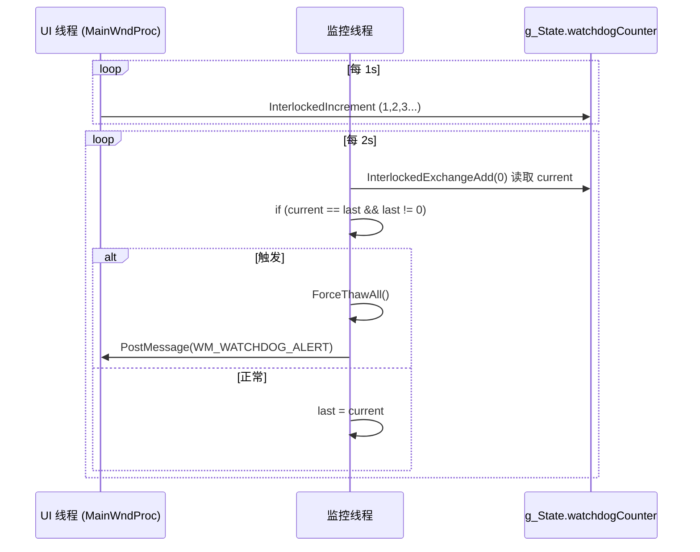
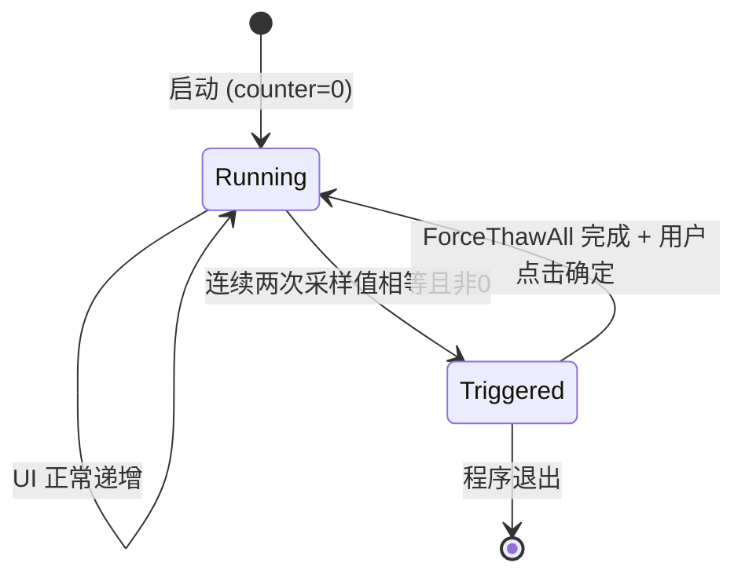

# 看门狗

**看门狗** 是 Stasis 的最后一道防线：监控线程每 2 秒检查 UI 线程心跳计数器，若连续两次读取值未变且非初始值，判定 UI 线程卡死，立即 **强制解冻所有进程** 并向用户弹窗告警。

## 什么是看门狗？

| 组件 | 角色 | 机制 |
|------|------|------|
| **UI 线程** | 被监控者 | `WM_WATCHDOG_TIMER` (1s 定时器) → `InterlockedIncrement(&g_State.watchdogCounter)` |
| **监控线程** | 监控者 | 每 2s `InterlockedExchangeAdd(&watchdogCounter, 0)` 读取当前值，与上次比较 |
| **判定条件** | 触发阈值 | `current == lastWatchdogCounter && lastWatchdogCounter != 0` (连续两次读取相同且非零) |
| **响应动作** | 兜底恢复 | `ForceThawAll()` + `PostMessage(hMainWnd, WM_WATCHDOG_ALERT, 0, 0)` |

## 关键特征

| 特征 | 说明 |
|------|------|
| **双线程心跳** | UI 递增计数器，监控线程采样比较，无共享锁 (原子操作) |
| **非零守卫** | `lastWatchdogCounter != 0` 防止启动初期误触发 (计数器从 0 开始) |
| **强制全量解冻** | `ForceThawAll` 遍历冻结栈 `ResumeProcessByPid`，不受解冻阈值限制 |
| **用户感知** | `WM_WATCHDOG_ALERT` → `MessageBox` 警告 "检测到UI无响应，已强制解冻所有进程！" |
| **定时器驱动** | UI 侧 `SetTimer(hwnd, WM_WATCHDOG_TIMER, 1000, NULL)` 1s 周期 |

## 代码位置

| 逻辑 | 文件:行 |
|------|---------|
| 计数器定义 | `Stasis.h:82` `volatile LONG watchdogCounter;` |
| UI 侧递增 | `app_window.c:221-223` `WM_TIMER` 分支 `wParam==WM_WATCHDOG_TIMER` |
| 监控侧检测 | `monitor_engine.c:136-153` `MonitorThread` 循环内 2s 采样块 |
| 强制解冻实现 | `monitor_engine.c:123-134` `ForceThawAll` |
| 告警消息处理 | `app_window.c:385-387` `WM_WATCHDOG_ALERT` case |
| 定时器创建 | `main.c:60` `SetTimer(hMain, WM_WATCHDOG_TIMER, 1000, NULL)` |
| 定时器销毁 | `app_window.c:406-407` `WM_DESTROY` `KillTimer(hwnd, WM_WATCHDOG_TIMER)` |

## 心跳时序



## 状态机



| 状态 | `watchdogCounter` 特征 | 动作 |
|------|------------------------|------|
| `Running` | 单调递增 (1,2,3...) | 监控线程每 2s 采样，`last` 更新为当前值 |
| `Triggered` | 连续两次采样值相同 (如 42, 42) | `ForceThawAll` + `PostMessage(WM_WATCHDOG_ALERT)` |

## ForceThawAll 实现

```c
void ForceThawAll(void) {
    EnterCriticalSection(&g_State.cs);
    while (g_State.frozenCount > 0) {
        DWORD pid = g_State.frozenStack[--g_State.frozenCount];
        LeaveCriticalSection(&g_State.cs);
        ResumeProcessByPid(pid);  // 锁外调用，避免阻塞
        EnterCriticalSection(&g_State.cs);
    }
    LeaveCriticalSection(&g_State.cs);
}
```

- **无阈值限制**：无论当前 CPU/内存多高，全部解冻
- **锁外恢复**：`ResumeProcessByPid` 可能阻塞，不持有临界区
- **清空栈**：循环直到 `frozenCount == 0`

## 告警消息流

```
MonitorThread (检测卡死)
    │
    ├─ ForceThawAll() → 解冻所有 PID
    │
    └─ PostMessage(hMainWnd, WM_WATCHDOG_ALERT, 0, 0)
            │
            ▼
MainWndProc (UI 线程恢复调度后)
            │
            ├─ case WM_WATCHDOG_ALERT:
            │    MessageBoxW(hwnd, L"检测到UI无响应，已强制解冻所有进程！", L"Stasis 看门狗", MB_ICONWARNING)
            │
            └─ 用户点击"确定" → 继续运行
```

> **关键点**：`PostMessage` **非阻塞**，监控线程不等待 UI 处理。UI 线程若真卡死，消息会留在队列，直到 UI 恢复 (或用户强杀) 才弹窗。这是有意为之——看门狗职责是**保命**，不阻塞监控线程。

## 配置常量

| 常量 | 定义位置 | 值 | 含义 |
|------|----------|-----|------|
| `WM_WATCHDOG_TIMER` | `Stasis.h:29` | `WM_APP + 2` | UI 定时器 ID |
| `WM_WATCHDOG_ALERT` | `Stasis.h:30` | `WM_APP + 3` | 告警消息 ID |
| 定时器周期 | `main.c:60` | 1000ms | UI 心跳间隔 |
| 采样周期 | `monitor_engine.c:143` | 2000ms | 监控线程检查间隔 |
| 判定窗口 | 隐含 | 2 个采样周期 (4s) | 连续两次未变才触发 |

## 关系

```mermaid
erDiagram
    UI_THREAD ||--o{ WATCHDOG_COUNTER : increments
    MONITOR_THREAD ||--o{ WATCHDOG_COUNTER : samples
    MONITOR_THREAD --> FORCE_THAW : triggers
    FORCE_THAW --> FROZEN_STACK : drains
    MONITOR_THREAD --> UI_THREAD : PostMessage(WM_WATCHDOG_ALERT)
    UI_THREAD --> USER_ALERT : MessageBox
```

| 关联概念 | 关系 | 描述 |
|----------|------|------|
| `UI Thread` | 生产者 | 1s 定时器原子递增计数器 |
| `Monitor Thread` | 消费者/裁判 | 2s 采样比较，判定卡死 |
| `WatchdogCounter` | 共享心跳 | `volatile LONG` + 原子操作，无锁 |
| `ForceThawAll` | 兜底动作 | 清空冻结栈，忽略阈值 |
| `WM_WATCHDOG_ALERT` | 用户通知 | UI 恢复调度后弹窗告知 |

## 为什么 2s 采样 + 连续两次？

| 参数 | 设定 | 理由 |
|------|------|------|
| UI 心跳 | 1s | 够频繁捕获卡顿，开销极小 |
| 采样间隔 | 2s | 覆盖 2 个 UI 心跳周期，避免单次采样抖动误判 |
| 连续两次 | 判定条件 | 排除 "UI 刚好在两次采样间完成一次心跳" 的极端竞态 |
| 总延迟 | 2~4s | 从 UI 卡死到触发解冻最长 4s (2s 等待首次采样 + 2s 确认) |

> **极端情况**：UI 在 `t=0` 卡死，监控线程 `t=2s` 首次采样得到 `N`，`t=4s` 二次采样仍为 `N` → 触发。最快 2s (若首次采样恰好落在卡死后)、最慢 4s。

## 误触发防御

| 场景 | 防御措施 |
|------|----------|
| 启动初期计数器为 0 | `lastWatchdogCounter != 0` 守卫 |
| UI 线程极度繁忙但未死锁 (心跳延迟但未停) | 只要 `Increment` 还在执行，计数器最终会变，采样会看到增长 |
| 监控线程自身被挂起 (极罕) | 监控线程优先级正常，不参与冻结，仅读取计数器 |
| `PostMessage` 队列满 | Windows 消息队列上限 10000，单条告警不会溢出 |

## 扩展建议

| 增强 | 实现思路 |
|------|----------|
| **可配置灵敏度** | INI 增加 `WatchdogIntervalMs` `WatchdogThresholdCount` (默认 2) |
| **事件日志** | `LogEvent(L"Watchdog triggered: counter=%d, frozen=%d", counter, frozenCount)` |
| **自动重启 UI** | `WM_WATCHDOG_ALERT` 收到后 `DestroyWindow` + 重新 `CreateMainWindow` (需保留监控线程) |
| **遥测上报** | 发送匿名触发统计到服务器 (需用户同意) |
| **分级响应** | 1 次触发 → 解冻 50% / 2 次 → 全量 / 3 次 → 重启 UI |