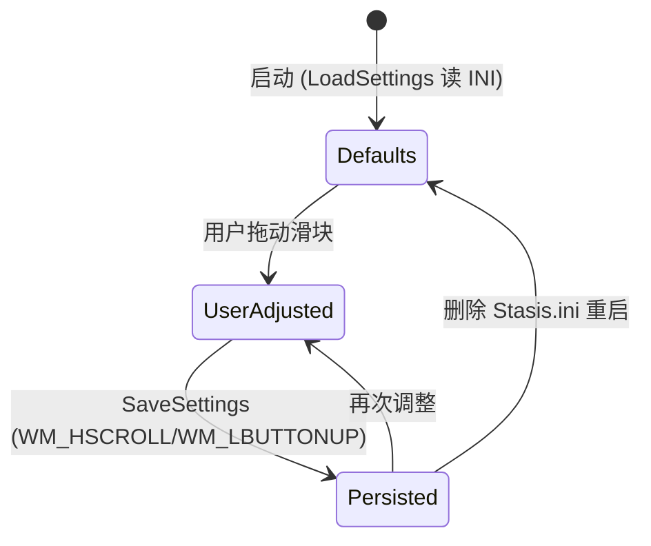

# 阈值体系

**阈值体系** 定义了 Stasis 何时触发冻结、何时触发解冻，采用 **双阈值滞回** 设计，避免临界点频繁震荡。

## 什么是阈值体系？

三个可配置的百分比阈值控制监控调度决策：

| 阈值名 | 宏定义 | 默认值 | 作用 | 存储键 (INI) |
|--------|--------|--------|------|--------------|
| **CPU 冻结阈值** | `DEFAULT_CPU_THRESHOLD` | 85% | 总 CPU ≥ 此值 → 触发冻结候选评估 | `CpuThreshold` |
| **内存冻结阈值** | `DEFAULT_MEM_THRESHOLD` | 90% | 总内存 ≥ 此值 → 触发冻结候选评估 | `MemThreshold` |
| **解冻阈值** | `DEFAULT_THAW_THRESHOLD` | 60% | 总 CPU **且** 内存 ≤ 此值 → 开始解冻 | `ThawThreshold` |

**触发逻辑**（`monitor_engine.c:40-45`）：

```c
// 冻结触发：任一超标即进入冻结流程
if (totalCpu < g_State.cpuThreshold && totalMem < g_State.memThreshold) return;

// 解冻触发：双指标均回落才解冻
if (totalCpu > g_State.thawThreshold || totalMem > g_State.thawThreshold) return;
```

## 关键特征

| 特征 | 说明 |
|------|------|
| **滞回** | 冻结阈值 (85/90) > 解冻阈值 (60)，中间 25-30% 缓冲区防抖 |
| **OR 触发冻结** | CPU **或** 内存任一超标即冻结，单一维度压力也能响应 |
| **AND 触发解冻** | CPU **且** 内存均回落才解冻，避免单指标回落导致过早解冻 |
| **用户可调** | 三个滑块 (CPU 50-100、内存 50-100、解冻 30-80) 实时保存生效 |
| **持久化** | `Stasis.ini` `[Settings]` 节，重启自动恢复 |

## 代码位置

| 方面 | 位置 |
|------|------|
| 宏默认值 | `Stasis.h:36-38` |
| 全局状态字段 | `Stasis.h:61-63` (`cpuThreshold`, `memThreshold`, `thawThreshold`) |
| 读取配置 | `settings_store.c:9-11` (`LoadSettings`) |
| 写入配置 | `settings_store.c:53-61` (`SaveSettings`) |
| UI 滑块创建 | `app_window.c:160-165` (`WM_CREATE` 创建 3 个 `BS_OWNERDRAW` 滑块) |
| UI 绘制/交互 | `app_window.c:347-353` (`WM_DRAWITEM` → `DrawSlider`) + `ui_controls.c:136-196` (`SliderSubclassProc`) |
| 监控决策 | `monitor_engine.c:40-45` (`FreezeHighCpuProcesses` 入口) + `104-108` (`ThawProcessesIfNeeded` 入口) |

## 结构

```c
// AppState 中的阈值字段
int cpuThreshold;   // 冻结触发 CPU% (50-100)
int memThreshold;   // 冻结触发 Mem% (50-100)
int thawThreshold;  // 解冻触发 % (30-80)
```

## 不变量

1. **范围约束**：UI 滑块步进 5%，代码不再二次校验（信任 UI 输入）
2. **滞回保证**：建议 `thawThreshold < min(cpuThreshold, memThreshold)`，否则可能冻结后立即解冻
3. **原子读取**：监控线程直接读取 `g_State.xxxThreshold` 无锁 (仅 `int` 单次读取，x86 原子)，配置变更通过 `SaveSettings` 同步刷新 UI

## 生命周期



### 状态描述

| 状态 | 描述 | 允许转换 |
|------|------|----------|
| `Defaults` | 使用代码内置默认值 (85/90/60) | → `UserAdjusted` (用户首次改动) |
| `UserAdjusted` | 用户通过滑块修改，内存中已生效 | → `Persisted` (自动保存) |
| `Persisted` | 已写入 `Stasis.ini`，重启后进入此状态 | → `UserAdjusted` (再次改动)<br/>→ `Defaults` (删配置文件) |

## 关系

```mermaid
erDiagram
    THRESHOLDS ||--o{ FREEZE_DECISION : triggers
    THRESHOLDS ||--o{ THAW_DECISION : triggers
    SLIDER_UI ||--|| THRESHOLDS : reads/writes
    INI_FILE ||--|| THRESHOLDS : persists
    MONITOR_THREAD ||--o{ THRESHOLDS : reads (lock-free)
```

| 关联概念 | 关系 | 描述 |
|----------|------|------|
| `FreezeDecision` | 触发 | `totalCpu >= cpuThreshold \|\| totalMem >= memThreshold` |
| `ThawDecision` | 触发 | `totalCpu <= thawThreshold && totalMem <= thawThreshold` |
| `SliderSubclassProc` | 读/写 | 鼠标拖动 → 计算比例 → 更新 `g_State.xxxThreshold` → `InvalidateRect` → `SaveSettings` |
| `Stasis.ini` | 持久化 | `GetPrivateProfileIntW` / `WritePrivateProfileStringW` |
| `MonitorThread` | 读取 | 500ms 循环直接读取 `g_State` 字段 (无锁单次读) |

## 滑块交互细节 (`ui_controls.c:136-196`)

```c
// 鼠标按下/移动/释放统一处理
double ratio = (double)pt.x / width;           // 0.0 - 1.0
*pVal = min + (int)(ratio * (max - min + 1));  // 映射到 [min, max]
*pVal = ((*pVal - min) / 5) * 5 + min;         // 5% 步进对齐
InvalidateRect(hwnd, NULL, TRUE);              // 触发 WM_DRAWITEM 重绘
SaveSettings();                                // 落盘
```

| 滑块 ID | min | max | 关联字段 |
|---------|-----|-----|----------|
| `IDC_SLIDER_CPU` | 50 | 100 | `cpuThreshold` |
| `IDC_SLIDER_MEM` | 50 | 100 | `memThreshold` |
| `IDC_SLIDER_THAW` | 30 | 80 | `thawThreshold` |

## 调优建议

| 场景 | 建议设置 | 理由 |
|------|----------|------|
| **8GB 内存轻度多任务** | CPU 80 / Mem 85 / Thaw 55 | 较早介入，保留更多缓冲 |
| **16GB+ 重度开发** | CPU 90 / Mem 95 / Thaw 65 | 容忍更高负载，减少误冻结 |
| **老旧设备/电池供电** | CPU 75 / Mem 80 / Thaw 50 | 激进省电，优先保前台 |
| **服务器/后台渲染** | CPU 95 / Mem 98 / Thaw 80 | 极少干预，仅极端保护 |

> ⚠️ `thawThreshold` 不宜设得太高 (≥ 冻结阈值)，否则会陷入“冻结→立即解冻→再冻结”循环，增加系统开销。