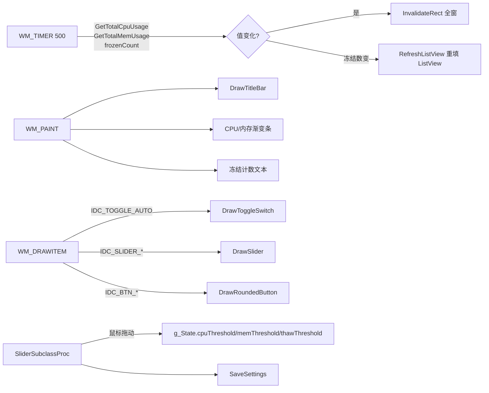

# 主窗口与 UI 模块

**文件**: `app_window.c` (457 行)

职责：无边框主窗口、自绘标题栏/状态栏、ListView 进程列表、自定义控件消息分发、托盘交互、DPI 响应、定时刷新。

## 核心结构

```
MainWndProc (窗口过程)
├── WM_CREATE
│   ├── ListView 创建 (报表模式、双缓冲、全行选择)
│   ├── 7 个 BS_OWNERDRAW 按钮/滑块创建
│   ├── 字体 WM_SETFONT 分发
│   ├── 滑块子类化 SetWindowSubclass
│   ├── 托盘图标创建
│   ├── 应用设置到 UI
│   └── 刷新定时器 (500, 1000ms)
├── WM_TIMER
│   ├── 500: 系统 CPU/内存/冻结数变化 → InvalidateRect
│   └── WM_WATCHDOG_TIMER: watchdogCounter++
├── WM_PAINT
│   ├── 全客户区背景填充 (RGB 25,25,35)
│   ├── DrawTitleBar (标题栏背景/图标/文字/最小化/关闭按钮)
│   ├── 状态栏背景 + CPU/内存渐变进度条 + 冻结计数文本
├── WM_ERASEBKGND → TRUE (防闪烁)
├── WM_DPICHANGED → UpdateDpiScale + SetWindowPos + InvalidateRect
├── WM_LBUTTONDOWN/MOVE/UP → 标题栏拖拽移动 (排除按钮区)
├── WM_DRAWITEM
│   ├── IDC_TOGGLE_AUTO → DrawToggleSwitch
│   ├── IDC_SLIDER_CPU/MEM/THAW → DrawSlider
│   └── IDC_BTN_WHITELIST/TRAY/OPTIONS → DrawRoundedButton
├── WM_COMMAND
│   ├── IDC_TOGGLE_AUTO: 切换 autoMode + 保存 + 重绘
│   ├── IDC_BTN_WHITELIST/OPTIONS: MessageBox 占位
│   ├── IDC_BTN_TRAY: 隐藏窗口 + 托盘驻留 + 降优先级
│   └── IDC_SYSLINK_FEEDBACK: ShellExecute 打开 GitHub Issues
├── WM_WATCHDOG_ALERT → MessageBox 告警
├── WM_TRAYICON → 右键菜单/双击恢复
├── WM_CLOSE → 隐藏到托盘 (同最小化)
└── WM_DESTROY → 清理定时器/字体/托盘/临界区/PostQuitMessage
```

## 关键函数

| 函数 | 行 | 说明 |
|------|-----|------|
| `CreateMainWindow` | 67-96 | 注册类、创建无边框窗口、启用亚克力、初始化字体 |
| `MainWndProc` | 128-417 | 核心消息分发 (见上述结构) |
| `DrawTitleBar` | 99-125 | 标题栏自绘：背景、图标、文字、最小化/关闭圆角按钮 |
| `RefreshListView` | 419-455 | 枚举进程→获取名/PID/内存→填充 ListView (状态图标 ❄️/▶️) |
| `UpdateUIFromState` | 457 | `InvalidateRect` 触发全窗重绘 |
| `UpdateDpiScale` | 58-63 | `GetDpiForWindow` → `g_dpiScale` → `RebuildFonts` |
| `RebuildFonts` | 35-56 | 删除旧字体、按 DPI 创建新字体 (标题 16pt、按钮 13pt、列表 14pt、状态 15pt) |

## 关键数据流



## 自定义消息

| 消息 | 定义 | 来源 | 处理 |
|------|------|------|------|
| `WM_WATCHDOG_TIMER` | `WM_APP+2` | `SetTimer(hwnd, WM_WATCHDOG_TIMER, 1000)` | `InterlockedIncrement(&g_State.watchdogCounter)` |
| `WM_WATCHDOG_ALERT` | `WM_APP+3` | 监控线程 `PostMessage` | `MessageBox` 告警 |
| `WM_TRAYICON` | `WM_APP+1` | `Shell_NotifyIcon` 回调 | `WM_RBUTTONUP`→菜单 / `WM_LBUTTONDBLCLK`→恢复窗口 |

## 资源管理

| 资源 | 创建 | 销毁 |
|------|------|------|
| 字体 `g_hTitleFont` `g_hBtnFont` `g_hListFont` `g_hStatusFont` | `RebuildFonts` (`CreateFontW`) | `WM_DESTROY` `DeleteObject` |
| 列表视图 `g_State.hListView` | `WM_CREATE` `CreateWindowW(WC_LISTVIEWW)` | 窗口销毁自动 |
| 托盘图标 `nid` | `CreateTrayIcon` (`Shell_NotifyIcon NIM_ADD`) | `WM_DESTROY`/`RemoveTrayIcon` (`NIM_DELETE`) |
| 定时器 500/WM_WATCHDOG_TIMER | `WM_CREATE` `SetTimer` | `WM_DESTROY` `KillTimer` |
| 滑块子类化 | `WM_CREATE` `SetWindowSubclass` | 窗口销毁自动移除 |

## DPI 响应

1. `CreateMainWindow` 初始 `GetDpiForSystem` → `g_dpiScale`
2. `WM_DPICHANGED` → `UpdateDpiScale` (取 `GetDpiForWindow`) → `RebuildFonts` → `SetWindowPos` 新建议尺寸 → `InvalidateRect`
3. 所有坐标/尺寸乘 `g_dpiScale` (如 `(int)(700*g_dpiScale)`)

## 亚克力模糊背景

```c
// EnableAcrylic (行 14-25)
typedef struct { DWORD AccentState, AccentFlags, GradientColor, AnimationId; } ACCENTPOLICY;
typedef struct { DWORD Attrib; PVOID pvData; SIZE_T cbData; } WINDOWCOMPOSITIONATTRIBDATA;
#define WCA_ACCENT_POLICY 19
#define ACCENT_ENABLE_BLURBEHIND 3

HMODULE hUser = GetModuleHandleW(L"user32.dll");
auto pSet = (BOOL(WINAPI*)(HWND,WINDOWCOMPOSITIONATTRIBDATA*))GetProcAddress(hUser, "SetWindowCompositionAttribute");
if (pSet) {
    ACCENTPOLICY policy = { ACCENT_ENABLE_BLURBEHIND, 0, 0, 0 };
    WINDOWCOMPOSITIONATTRIBDATA data = { WCA_ACCENT_POLICY, &policy, sizeof(policy) };
    pSet(hwnd, &data);
    g_State.acrylicEnabled = TRUE;
}
```

- Win10 1809+ 支持，失败静默降级为纯色背景
- `WM_PAINT` 先填充深色背景再绘制标题栏/状态栏，亚克力仅作窗口整体模糊

## 控件 ID 映射 (`Stasis.h`)

| ID | 控件 | 类型 | 处理 |
|----|------|------|------|
| 1001 | `IDC_LISTVIEW` | `SysListView32` | `RefreshListView` 填充 |
| 1002 | `IDC_TOGGLE_AUTO` | `BUTTON` `BS_OWNERDRAW` | `WM_DRAWITEM`→`DrawToggleSwitch` / `WM_COMMAND` 切换 |
| 1003 | `IDC_SLIDER_CPU` | `BUTTON` `BS_OWNERDRAW` | `WM_DRAWITEM`→`DrawSlider` / 子类化拖动 |
| 1004 | `IDC_SLIDER_MEM` | 同上 | 同上 |
| 1005 | `IDC_SLIDER_THAW` | 同上 | 同上 |
| 1006 | `IDC_BTN_WHITELIST` | `BUTTON` `BS_OWNERDRAW` | `WM_DRAWITEM`→`DrawRoundedButton` / `WM_COMMAND` 占位 |
| 1007 | `IDC_BTN_TRAY` | 同上 | `WM_COMMAND` 隐藏到托盘 |
| 1008 | `IDC_BTN_OPTIONS` | 同上 | `WM_COMMAND` 占位 |
| 1011 | `IDC_SYSLINK_FEEDBACK` | `SysLink` | `WM_COMMAND` `ShellExecute` |

## 依赖

| 模块 | 调用 |
|------|------|
| `ui_controls.c` | `DrawRoundedButton` `DrawToggleSwitch` `DrawSlider` `DrawGradientProgressBar` `SliderSubclassProc` |
| `tray_icon.c` | `CreateTrayIcon` `UpdateTrayIcon` `ShowTrayMenu` |
| `settings_store.c` | `ApplySettingsToUI` `SaveSettings` |
| `monitor_engine.c` | `GetTotalCpuUsage` `GetTotalMemUsage` |
| `process_manager.c` | `EnumProcessesEx` `GetProcessMemoryKB` `QueryFullProcessImageNameW` |
| `log.c` | `DebugLog` |

## 测试清单

- [ ] 100%/125%/150%/200% DPI 下窗口/字体/控件无模糊、位置正确
- [ ] 拖拽标题栏移动窗口、不触发最小化/关闭按钮
- [ ] 最小化/关闭按钮点击 → 窗口隐藏 → 托盘图标出现 → 双击托盘恢复
- [ ] "自动" 开关切换 → `Stasis.ini` `AutoMode` 更新 → 重启保持
- [ ] 三个滑块拖动 → 阈值实时变化 → `Stasis.ini` 同步 → 重启保持
- [ ] 高负载下 ListView 实时刷新、冻结进程显示 ❄️、解冻显示 ▶️
- [ ] `--debug` 模式 → `Stasis.log` 记录 `WM_CREATE`/`WM_TIMER` 等调试行
- [ ] 窗口关闭 → `WM_DESTROY` 清理所有字体/定时器/托盘/临界区/互斥体