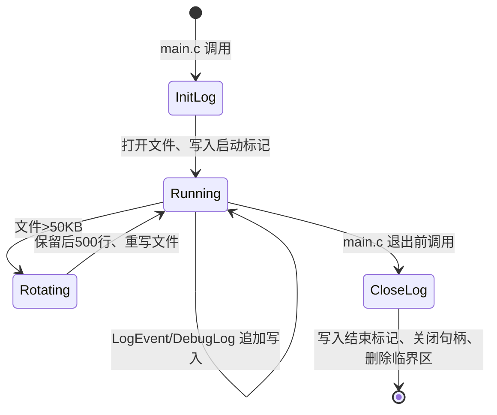

# 日志模块

**文件**: `log.c` (95 行)

职责：线程安全、带毫秒时间戳、支持调试模式、文件超大自动轮转 (保留最近 500 行) 的文本日志系统。

## 核心数据结构

```c
#define LOG_FILE L"Stasis.log"
#define LOG_MAX_LINES 500

static FILE* g_LogFile = NULL;
static CRITICAL_SECTION g_LogCs;
```

- `g_LogFile`：日志文件句柄，`_wfopen(..., L"w, ccs=UNICODE")` 以 UTF-16LE 写入
- `g_LogCs`：临界区保护所有写操作 (含轮转)

## API

| 函数 | 参数 | 说明 |
|------|------|------|
| `InitLog` | `void` | 初始化临界区、打开文件、写入启动标记 `=== Stasis Log Started ===` |
| `CloseLog` | `void` | 写入结束标记、关闭文件、删除临界区 |
| `LogEvent` | `const WCHAR* format, ...` | 正式日志，带时间戳，`va_list` 格式化，`fflush` 落盘，**文件>50KB触发轮转** |
| `DebugLog` | `const WCHAR* format, ...` | 仅 `g_DebugMode==TRUE` 时写入，前缀 `DEBUG:` |

## 时间戳格式

```c
SYSTEMTIME st; GetLocalTime(&st);
fwprintf(g_LogFile, L"[%04d-%02d-%02d %02d:%02d:%02d.%03d] ",
    st.wYear, st.wMonth, st.wDay, st.wHour, st.wMinute, st.wSecond, st.wMilliseconds);
```

示例：
```
[2025-07-12 10:30:45.123] Frozen PID 1234
[2025-07-12 10:30:45.234] Resumed PID 1234
[2025-07-12 10:30:45.345] DEBUG: MonitorThread: watchdog triggered
```

## 轮转机制 (`LogEvent` 内部)

```c
fseek(g_LogFile, 0, SEEK_END);
long size = ftell(g_LogFile);
if (size > 50 * 1024) {  // 50KB 阈值
    fclose(g_LogFile);
    FILE* fSrc = _wfopen(LOG_FILE, L"r, ccs=UNICODE");
    if (fSrc) {
        WCHAR* lines[1000] = {0};
        int lineCount = 0;
        WCHAR buf[512];
        BOOL allocFailed = FALSE;
        while (fgetws(buf, 512, fSrc) && lineCount < 1000) {
            size_t len = wcslen(buf);
            lines[lineCount] = malloc((len+1)*sizeof(WCHAR));
            if (!lines[lineCount]) { allocFailed = TRUE; break; }
            wcscpy_s(lines[lineCount], len+1, buf);
            lineCount++;
        }
        fclose(fSrc);
        if (!allocFailed) {
            g_LogFile = _wfopen(LOG_FILE, L"w, ccs=UNICODE");
            if (g_LogFile) {
                int start = lineCount > LOG_MAX_LINES ? lineCount - LOG_MAX_LINES : 0;
                for (int i = start; i < lineCount; i++) fputws(lines[i], g_LogFile);
            }
        }
        for (int i = 0; i < lineCount; i++) free(lines[i]);
    }
    if (!g_LogFile) g_LogFile = _wfopen(LOG_FILE, L"a, ccs=UNICODE");
}
g_State.logFile = g_LogFile;  // 同步全局句柄供外部查看
```

**关键点**：

| 参数 | 值 | 说明 |
|------|-----|------|
| 触发阈值 | 50 KB | 避免日志无限增长 |
| 最大保留行 | 500 行 (`LOG_MAX_LINES`) | 保留最近上下文 |
| 读取缓冲 | 512 字符/行 | 足覆盖单行日志 |
| 临时数组 | 1000 行上限 | 防止极端情况下内存耗尽 |
| 编码 | UTF-16LE (`ccs=UNICODE`) | 支持中文、特殊字符 |
| 分配失败保护 | `allocFailed` 标记 | 失败时回退追加模式，不丢数据 |

## 线程安全

- 所有公共函数 (`InitLog`/`CloseLog`/`LogEvent`/`DebugLog`) 均在 `EnterCriticalSection(&g_LogCs)` / `LeaveCriticalSection(&g_LogCs)` 包裹
- `LogEvent` 轮转内部也持有临界区 (整个函数在锁内)
- `g_State.logFile` 同步更新，供 `DebugLog`/外部模块直接使用句柄 (需自行加锁)

## 调试模式

```c
// main.c:21-22
if (wcsstr(pCmdLine, L"--debug")) g_DebugMode = TRUE;

// log.c:95-103
void DebugLog(const WCHAR* format, ...) {
    if (!g_DebugMode) return;
    EnterCriticalSection(&g_LogCs);
    if (!g_LogFile) { LeaveCriticalSection(&g_LogCs); return; }
    // 写入 [时间] DEBUG: + 格式化内容
}
```

- 启动参数 `--debug` 开启
- 仅写入文件，不输出控制台 (GUI 程序无控制台)
- 适合开发期追踪 `FreezeHighCpuProcesses` 调用、看门狗触发、白名单命中等高频事件

## 全局句柄同步

```c
// log.c:14
g_State.logFile = g_LogFile;

// log.c:91 (轮转后)
g_State.logFile = g_LogFile;
```

- `AppState.logFile` 暴露给外部 (如 `monitor_engine.c` 直接 `LogEvent` 内部用)
- 外部若直接用 `g_State.logFile` 写入，**必须**自行 `Enter/LeaveCriticalSection(&g_LogCs)`

## 依赖

| API | DLL | 用途 |
|-----|-----|------|
| `InitializeCriticalSection` `EnterCriticalSection` `LeaveCriticalSection` `DeleteCriticalSection` | `kernel32.dll` | 同步 |
| `_wfopen` `fwprintf` `vfwprintf` `fflush` `fseek` `ftell` `fclose` `fgetws` `fputws` `free` `malloc` | `ucrtbase.dll` / `msvcrt.dll` | 宽字符文件 I/O、内存 |
| `GetLocalTime` | `kernel32.dll` | 时间戳 |
| `GetCurrentProcessId` | `kernel32.dll` | (可选) 记录 PID |

## 生命周期



## 与全局状态集成

```c
// Stasis.h:84
FILE* logFile;

// main.c:51-52
InitLog();
LoadSettings();  // 此时日志已可用

// main.c:72
CloseLog();
```

- 日志最早初始化 (仅次于临界区/互斥体)，确保后续所有模块报错均可记录
- 退出时最后关闭，捕获清理阶段可能的错误

## 扩展建议

| 功能 | 实现思路 |
|------|----------|
| **日志级别** | 增加 `LOG_INFO/WARN/ERROR` 宏，`LogEvent` 写入级别标签，`InitLog` 读 INI `LogLevel` 过滤 |
| **结构化日志** | 输出 JSON Lines (`{"ts":"...","lvl":"INFO","msg":"Frozen PID 1234"}`) 便于 ELK/Splunk 采集 |
| **远程上报** | `LogEvent` 内 `InternetOpenUrl`/`WinHttp` 批量上传 (需异步队列避免阻塞) |
| **控制台附加** | `AttachConsole(ATTACH_PARENT_PROCESS)` + `_open_osfhandle` 双写文件+控制台 (仅 `--debug` 时) |
| **日志归档** | 每日/按大小切割为 `Stasis_20250712.log`，保留 N 个归档文件 |
| **性能计数器** | `QueryPerformanceCounter` 替代 `GetLocalTime` 纳秒级时间戳 (高频场景) |

## 测试清单

- [ ] 启动 → `Stasis.log` 创建、首行 `=== Stasis Log Started ===`
- [ ] 正常操作 → `Frozen PID xxx` / `Resumed PID xxx` 实时追加
- [ ] `--debug` 启动 → 出现 `DEBUG:` 前缀行
- [ ] 手动写入 >50KB (循环 `LogEvent` 1000 次) → 文件大小回落、保留最后 500 行
- [ ] 多线程并发写入 (监控线程 + UI 线程) → 无乱序/截断/崩溃
- [ ] 退出 → 末尾 `=== Stasis Log Closed ===`、文件句柄释放
- [ ] `Stasis.log` 用记事本/Notepad++ 打开 → UTF-16LE 正常显示中文
- [ ] 磁盘满/只读 → `LogEvent` 内部 `fwprintf` 失败不崩溃 (当前未显式检查返回值，建议加 `if (fwprintf(...)<0) ...`)