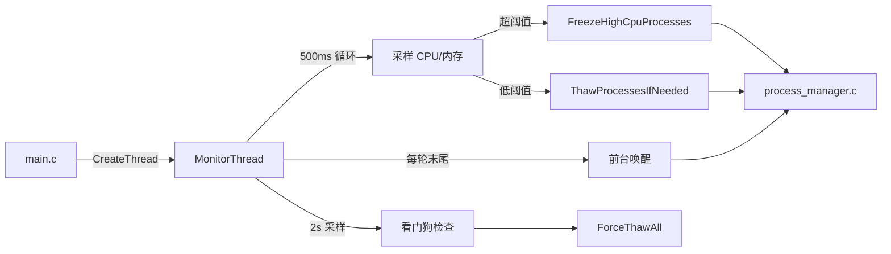

# 监控调度模块

**文件**: `monitor_engine.c` (195 行)

核心职责：后台线程周期性采样系统 CPU/内存，按**双阈值滞回**决策冻结/解冻，内置**看门狗**、**前台唤醒**、**单轮限速**。

## 架构定位



## 监控线程主循环 (`MonitorThread`)

```c
DWORD WINAPI MonitorThread(LPVOID param) {
    LONG lastWatchdogCounter = 0;
    DWORD lastCheck = 0;
    while (g_State.monitorRunning) {
        DWORD now = GetTickCount();
        // 1. 看门狗 (2s 间隔)
        if (now - lastCheck > 2000) {
            lastCheck = now;
            LONG current = InterlockedExchangeAdd(&g_State.watchdogCounter, 0);
            if (current == lastWatchdogCounter && lastWatchdogCounter != 0) {
                ForceThawAll();                    // 强制全量解冻
                PostMessage(g_State.hMainWnd, WM_WATCHDOG_ALERT, 0, 0); // UI 告警
            }
            lastWatchdogCounter = current;
        }

        // 2. 自动冻结/解冻
        if (!g_State.pauseAuto && g_State.autoMode) {
            FreezeHighCpuProcesses();  // 按阈值冻结
            ThawProcessesIfNeeded();   // 按阈值解冻
        }

        // 3. 前台唤醒 (仅当有冻结进程时)
        BOOL hasFrozen;
        EnterCriticalSection(&g_State.cs);
        hasFrozen = (g_State.frozenCount > 0);
        LeaveCriticalSection(&g_State.cs);

        if (hasFrozen) {
            HWND hFg = GetForegroundWindow();
            if (hFg) {
                DWORD fgPid;
                GetWindowThreadProcessId(hFg, &fgPid);
                EnterCriticalSection(&g_State.cs);
                for (int i = 0; i < g_State.frozenCount; i++) {
                    if (g_State.frozenStack[i] == fgPid) {
                        DWORD wakePid = fgPid;
                        memmove(&g_State.frozenStack[i], &g_State.frozenStack[i+1],
                                (g_State.frozenCount - i - 1) * sizeof(DWORD));
                        g_State.frozenCount--;
                        LeaveCriticalSection(&g_State.cs);
                        ResumeProcessByPid(wakePid);
                        EnterCriticalSection(&g_State.cs);
                        break;
                    }
                }
                LeaveCriticalSection(&g_State.cs);
            }
        }

        Sleep(MONITOR_INTERVAL);  // 500ms
    }
    return 0;
}
```

## 核心调度函数

### `FreezeHighCpuProcesses` (冻结决策)

```c
void FreezeHighCpuProcesses(void) {
    double totalCpu = GetTotalCpuUsage();
    double totalMem = GetTotalMemUsage();
    // 任一超标触发
    if (totalCpu < g_State.cpuThreshold && totalMem < g_State.memThreshold) return;

    DWORD pids[1024]; int count;
    EnumProcessesEx(pids, 1024, &count);
    ProcCpu* procs = malloc(count * sizeof(ProcCpu));
    int valid = 0;

    for (int i = 0; i < count; i++) {
        DWORD pid = pids[i];
        if (pid == 0 || pid == 4) continue;  // 跳过 Idle/System
        // 获取进程名
        HANDLE hProc = OpenProcess(PROCESS_QUERY_LIMITED_INFORMATION|PROCESS_VM_READ, FALSE, pid);
        if (!hProc) continue;
        WCHAR path[MAX_PATH]; DWORD sz = MAX_PATH;
        if (!QueryFullProcessImageNameW(hProc, 0, path, &sz)) { CloseHandle(hProc); continue; }
        WCHAR* fname = wcsrchr(path, L'\\');
        WCHAR name[MAX_PATH]; wcscpy_s(name, MAX_PATH, fname ? fname+1 : path);
        CloseHandle(hProc);

        // 白名单/保护检查
        if (IsCriticalProcess(name)) continue;
        if (IsProcessForeground(pid)) continue;
        if (IsProcessInUserWhitelist(name)) continue;
        if (IsCurrentProcess(pid)) continue;

        procs[valid].pid = pid;
        procs[valid].cpu = 5.0;  // 简化占位 (实际可用 GetProcessTimes 计算单进程 CPU)
        valid++;
    }

    qsort(procs, valid, sizeof(ProcCpu), CompareProcCpu);  // CPU 降序

    int maxFreezeThisRound = 5;    // 单轮上限
    int frozenThisRound = 0;

    for (int i = 0; i < valid && frozenThisRound < maxFreezeThisRound; i++) {
        double curCpu = GetTotalCpuUsage();
        double curMem = GetTotalMemUsage();
        if (curCpu <= g_State.thawThreshold && curMem <= g_State.thawThreshold) break;  // 中途解冻条件满足即停

        if (!SuspendProcessByPid(procs[i].pid)) continue;
        EnterCriticalSection(&g_State.cs);
        if (g_State.frozenCount < 1024)
            g_State.frozenStack[g_State.frozenCount++] = procs[i].pid;
        LeaveCriticalSection(&g_State.cs);
        frozenThisRound++;
        Sleep(100);  // 限速
    }
    free(procs);
    PostMessage(g_State.hMainWnd, WM_USER+1, 0, 0);  // 通知 UI 刷新
}
```

**关键策略**：

| 策略 | 参数 | 作用 |
|------|------|------|
| **OR 触发冻结** | `cpu >= 85% \|\| mem >= 90%` | 单维度压力即响应 |
| **单轮限速** | `maxFreezeThisRound = 5` | 防止雪崩式冻结导致系统抖动 |
| **冻结间隔** | `Sleep(100)` | 给调度器喘息时间 |
| **中途解冻检查** | 每轮循环前 `if (curCpu<=thaw && curMem<=thaw) break` | 资源已缓解即停止冻结 |
| **简化 CPU 估值** | `cpu = 5.0` 占位 | 实际可替换为 `GetProcessTimes` 计算单进程 CPU% |

### `ThawProcessesIfNeeded` (解冻决策)

```c
void ThawProcessesIfNeeded(void) {
    double totalCpu = GetTotalCpuUsage();
    double totalMem = GetTotalMemUsage();
    // 双指标均回落才解冻 (AND 滞回)
    if (totalCpu > g_State.thawThreshold || totalMem > g_State.thawThreshold) return;

    EnterCriticalSection(&g_State.cs);
    while (g_State.frozenCount > 0) {
        DWORD pid = g_State.frozenStack[--g_State.frozenCount];  // LIFO
        LeaveCriticalSection(&g_State.cs);
        ResumeProcessByPid(pid);
        EnterCriticalSection(&g_State.cs);
        // 中途资源再次飙高即停止
        if (GetTotalCpuUsage() > g_State.thawThreshold || GetTotalMemUsage() > g_State.thawThreshold)
            break;
    }
    LeaveCriticalSection(&g_State.cs);
}
```

**LIFO 顺序**：最近冻结的最先恢复，符合“后台任务优先释放”直觉。

### `ForceThawAll` (看门狗/退出兜底)

```c
void ForceThawAll(void) {
    EnterCriticalSection(&g_State.cs);
    while (g_State.frozenCount > 0) {
        DWORD pid = g_State.frozenStack[--g_State.frozenCount];
        LeaveCriticalSection(&g_State.cs);
        ResumeProcessByPid(pid);
        EnterCriticalSection(&g_State.cs);
    }
    LeaveCriticalSection(&g_State.cs);
}
```

- 无阈值判断、无限速、清空栈
- 退出时 `main.c:70` 调用、看门狗触发时调用

## 系统采样函数

| 函数 | 实现 | 返回 |
|------|------|------|
| `GetTotalCpuUsage` | `GetSystemTimes` 取 idle/kernel/user，两次差值计算 `(1 - idle/total)*100` | `0.0~100.0` |
| `GetTotalMemUsage` | `GlobalMemoryStatusEx` 取 `dwMemoryLoad` | `0~100` (整数%) |

```c
double GetTotalCpuUsage(void) {
    static ULONGLONG prevIdle=0, prevKernel=0, prevUser=0;
    FILETIME idle, kernel, user;
    GetSystemTimes(&idle, &kernel, &user);
    ULONGLONG idleT = ((ULONGLONG)idle.dwHighDateTime<<32) | idle.dwLowDateTime;
    ULONGLONG kernT = ((ULONGLONG)kernel.dwHighDateTime<<32) | kernel.dwLowDateTime;
    ULONGLONG userT = ((ULONGLONG)user.dwHighDateTime<<32) | user.dwLowDateTime;
    if (prevIdle==0) { prevIdle=idleT; prevKernel=kernT; prevUser=userT; return 0.0; }
    ULONGLONG idleDiff = idleT - prevIdle;
    ULONGLONG kernDiff = kernT - prevKernel;
    ULONGLONG userDiff = userT - prevUser;
    ULONGLONG totalDiff = kernDiff + userDiff;
    prevIdle=idleT; prevKernel=kernT; prevUser=userT;
    if (totalDiff==0) return 0.0;
    return (double)(totalDiff - idleDiff) / totalDiff * 100.0;
}
```

## 线程安全模型

| 共享数据 | 访问者 | 同步方式 |
|----------|--------|----------|
| `g_State.autoMode/pauseAuto/thresholds` | 监控线程读 / UI 写 | **无锁单次读** (原子 `int`，x86 对齐访问原子) |
| `g_State.frozenStack/count` | 监控线程读写 / UI 读 | `CRITICAL_SECTION g_State.cs` |
| `g_State.userWhitelist/count` | 监控线程读 / UI 写 | 同 `cs` |
| `g_State.watchdogCounter` | UI 线程 `InterlockedIncrement` / 监控线程 `InterlockedExchangeAdd(0)` | **无锁原子操作** |

## 配置常量 (`Stasis.h`)

| 常量 | 默认值 | 用途 |
|------|--------|------|
| `DEFAULT_CPU_THRESHOLD` | 85 | CPU 冻结阈值 |
| `DEFAULT_MEM_THRESHOLD` | 90 | 内存冻结阈值 |
| `DEFAULT_THAW_THRESHOLD` | 60 | 解冻阈值 |
| `MONITOR_INTERVAL` | 500 | 监控循环周期 |
| `WATCHDOG_TIMEOUT` | 5000 | 未直接使用 (预留) |

## 依赖

| 模块 | 函数 |
|------|------|
| `process_manager.c` | `SuspendProcessByPid` `ResumeProcessByPid` `EnumProcessesEx` `IsCriticalProcess` `IsProcessForeground` `IsProcessInUserWhitelist` `IsCurrentProcess` |
| `app_window.c` | `PostMessage(hMainWnd, WM_WATCHDOG_ALERT)` `PostMessage(hMainWnd, WM_USER+1)` |
| `log.c` | `LogEvent` `DebugLog` |

## 可观测性

| 日志点 | 级别 | 内容 |
|--------|------|------|
| `DebugLog(L"FreezeHighCpuProcesses called")` | Debug | 每轮冻结入口 |
| `LogEvent(L"Frozen PID %lu", pid)` | Info | 成功冻结 |
| `LogEvent(L"Resumed PID %lu", pid)` | Info | 成功解冻 |
| 看门狗触发 | 建议添加 | `LogEvent(L"Watchdog triggered: counter=%d, frozen=%d", counter, frozenCount)` |

## 扩展建议

| 方向 | 实现思路 |
|------|----------|
| **单进程 CPU 精准采样** | `GetProcessTimes` 计算每进程 `(kernel+user) diff / total diff`，替换 `5.0` 占位 |
| **分级冻结** | 先冻结高 CPU 非关键，若仍超标再冻结中 CPU，保留低 CPU 进程 |
| **自适应阈值** | 基于历史负载动态微调 `cpuThreshold`/`memThreshold` (EWMA) |
| **冻结原因记录** | `LogEvent(L"Freeze: PID=%lu name=%s cpu=%.1f mem=%.1f reason=threshold", ...)` |
| **解冻优先级策略** | 当前 LIFO → 可改为按 "冻结时长" 或 "进程重要性" 排序 |
| **指标导出** | 共享内存/命名管道导出 `totalCpu/totalMem/frozenCount` 供外部监控 |